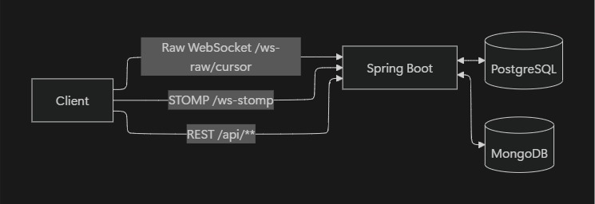

# Backend

## 1) 소개

Spring Boot 기반 **REST API + STOMP(WebSocket) + Raw WebSocket** 서버입니다. \
도메인: 방 생성·참여, 채팅/후보 공유, 즐겨찾기, 장소 조회. \
저장소: **PostgreSQL**(주요 엔터티), **MongoDB**(채팅/이력).

---

## 2) 기술 & 버전

* **Java 21**, **Spring Boot 3.5.4**, **Gradle 8.5**
* Web: `spring-boot-starter-web`, `spring-boot-starter-websocket`
* 보안: `spring-boot-starter-security`, `spring-security-messaging`, `jjwt 0.12.6`, OAuth2 Client
* 데이터: `spring-data-jpa`, `spring-data-mongodb`, `postgresql 42.7.3`
* 문서: `springdoc-openapi-starter-webmvc-ui 2.5.0`
* 기타: Lombok, Hashids

---

## 3) 아키텍처



**STOMP**

* **SEND**: `/app/chat.{roomCode}`, `/app/candidate.{roomCode}`
* **SUB** : `/topic/chat.{roomCode}`, `/topic/candidate.{roomCode}`

**Raw WebSocket**

* **엔드포인트**: `/ws-raw/cursor?roomCode=...&token=Bearer…`
* 용도: 실시간 커서/좌표 브로드캐스트

---

## 4) REST API 요약

* **Rooms**

    * `POST /api/rooms` 방 생성
    * `GET /api/rooms/{roomCode}` 방 조회
    * `POST /api/rooms/{roomCode}` 방 참가 응답
* **Auth**

    * `POST /api/auth/guest` 게스트 로그인
    * `POST /api/auth/upgrade` 게스트→유저 승격
    * `POST /api/reissue` 토큰 재발급
    * `PATCH /api/auth/nickname` 닉네임 변경
* **Places & Favorites**

    * `POST /api/places/ensure-batch` 장소 일괄 보장(upsert)
    * `GET /api/places/{placeId}` 장소 상세
    * `GET /api/favorites`, `POST /api/favorites`, `DELETE /api/favorites/{favoriteId}`
* **History / StartPoint**

    * `GET /api/chats/{roomCode}/history` 채팅 히스토리
    * `GET /api/candidates/history/{roomCode}` 후보 히스토리
    * `PATCH /api/start-point/{roomCode}/{userId}` 시작 위치 갱신
* **API 문서**: `/swagger-ui/index.html`

---

## 5) 디렉터리 구조(요약)

```
src/
 ├─ main/
 │  ├─ java/com/example/whereshouldwego/
 │  │  ├─ auth/                  # 로그인/게스트→유저, JWT·OAuth2, 보안설정
 │  │  │   ├─ controller/ domain/ dto/ repository/
 │  │  │   └─ security/{config,jwt,oauth2,ws}
 │  │  ├─ common/                # 공통 설정, 로깅, 유틸
 │  │  │   ├─ config/ logging/ util/
 │  │  ├─ features/              # 비즈 도메인 모듈 단위
 │  │  │   ├─ candidate/         # 후보지: controller/domain/dto/repository/service
 │  │  │   ├─ chat/              # 채팅: mongo repository 포함
 │  │  │   ├─ place/             # 장소
 │  │  │   ├─ room/              # 방
 │  │  │   └─ user/              # 사용자
 │  │  ├─ infrastructure/mongo/  # Mongo 설정
 │  │  └─ realtime/              # 실시간(WS/STOMP) 구성
 │  │      ├─ config/            # 메시지 브로커/EndPoint 설정
 │  │      ├─ dto/{request,response}
 │  │      ├─ handler/           # Raw WebSocket 핸들러
 │  │      └─ session/           # 세션 관리(맵, 추적)
 │  └─ resources/
 │      └─ static/               # 정적 리소스(필요 시)
 └─ test/java/com/example/whereshouldwego/
     ├─ config/ controller/ infrastructure/ service/
```

* **features**는 “기능 단위 모듈화”로 controller–service–repository–domain–dto가 한 폴더에 모여 있어 탐색성이 좋습니다.
* **realtime**는 STOMP와 Raw WS 설정/핸들러/세션을 분리해 실시간 로직의 응집도를 높였습니다.
* **auth/security/ws**는 STOMP 메시징 보안(인증/구독 검증)과 연계됩니다.

### 6) 담당 역할

<table>
  <tr align="center" valign="top">
    <td>
      <a href="https://github.com/Yoo99">
        
      </a><br/>
      <a href="https://github.com/Yoo99"><b>Yoo99</b></a>
    </td>
    <td>
      <a href="https://github.com/haeri5655">
        
      </a><br/>
      <a href="https://github.com/haeri5655"><b>haeri5655</b></a>
    </td>
    <td>
      <a href="https://github.com/GomDue">
        
      </a><br/>
      <a href="https://github.com/GomDue"><b>GomDue</b></a>
    </td>
  </tr>
  <tr align="center">
    <td><sub>Back-End 팀장, REST API 구축</sub></td>
    <td><sub>OAuth2 기반 인증/인가 구현</sub></td>
    <td><sub>WebSocket, STOMP 기반 실시간 통신 구현</sub></td>
  </tr>
</table>